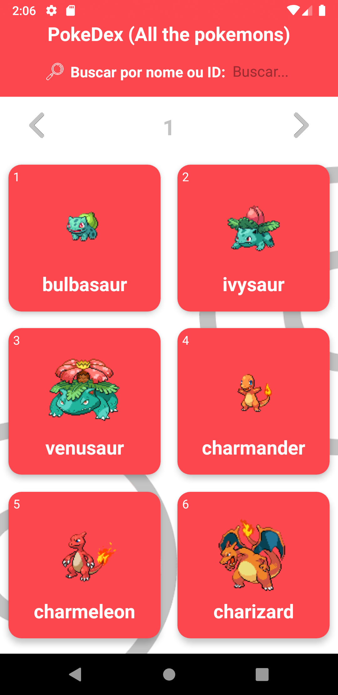
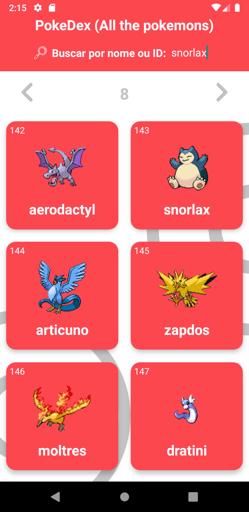
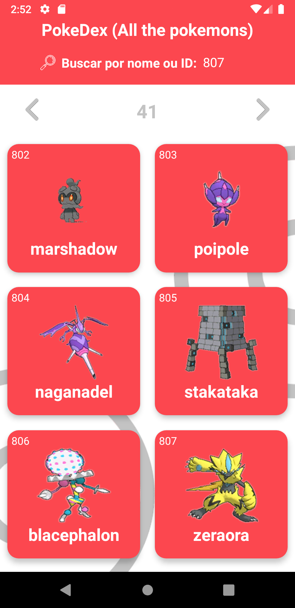
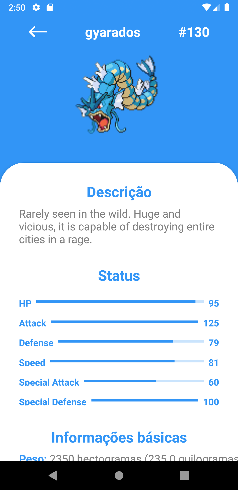
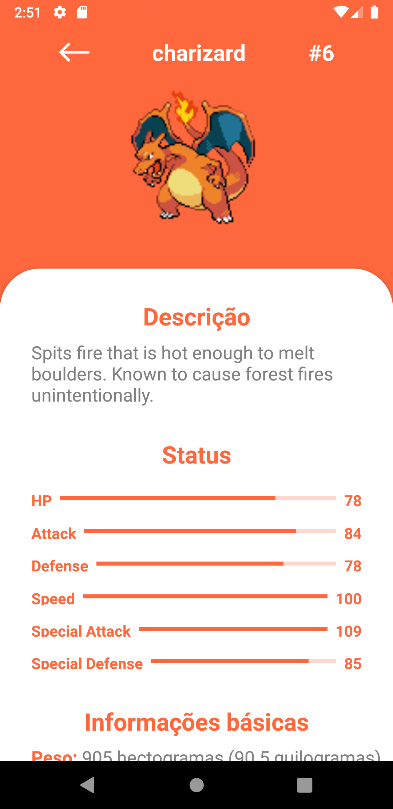
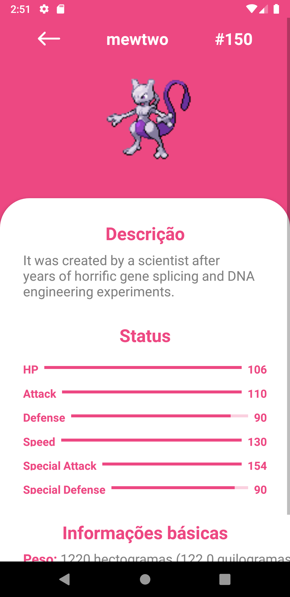
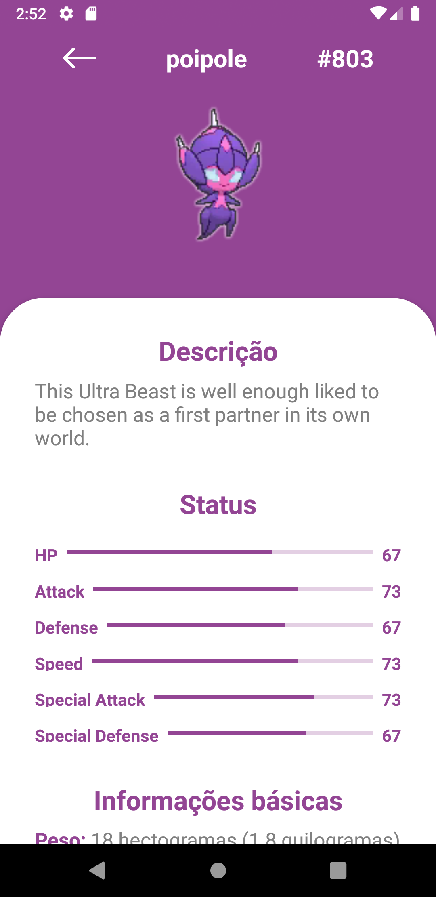

<h1 align="center">
    PokeGuide
</h1>

# 📋 ABSTRACT
<strong>English:</strong> This application was conceived in the practice of a simple and modern front-end development, with grids, color variations, etc. In addition, the main focus was on practice and evolution in the consumption of APIs with axios. Finally, the project is the result of a whole training for language growth, a great base in styles, navigation, requisitions, among others.   
<strong>Português: </strong>Esta aplicação foi pensada na pratica de um desenvolvimento front-end simples e moderno, com grades, variações de cores, etc. Ademais, o foco principal deu-se na prática e evolução no consumo de APIs com o axios. Por fim, o projeto é o resultado de todo um treino para o crescimento na linguagem, uma grande base em estilos, navagações, requisições, entre outros.   

# 📖 PROJECT DATA
React Native project using the "PokeApi" API to create a pokedex.  
API: https://pokeapi.co/. 
Packages: axios and react-navigation. 
React Native version: 0.59.9.  

# 🖼 SCREENSHOTS
Image 1 (Initial screen); 
Image 2 (Main screen); 
Image 3 (Main screen - search by name); 
Image 4 Main screen - search by ID); 
Image 5, 6, 7 and 8 (Characteristics screen - selected pokemon).  

                                             
